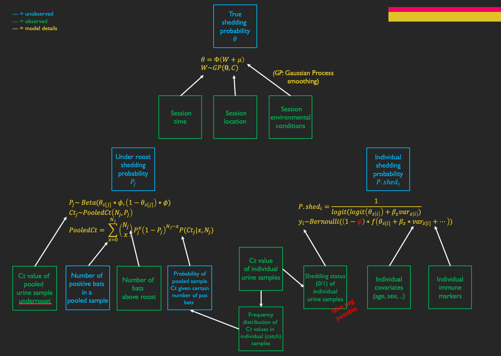

```{r global_options, include = FALSE,results='hide'}
knitr::opts_chunk$set(echo = FALSE, results = 'hide',warning = FALSE, message = FALSE,tidy.opts=list(width.cutoff=90),fig.height=4,fig.width=4,dev='pdf',fig.align='center',out.width = "70%")

setwd(dirname(rstudioapi::getActiveDocumentContext()$path))  # set file folder as working directory, need to save file first

library(tidyverse) # data handling
library(ggplot2) # plotting
library(patchwork) # combine plots
library(RColorBrewer) # use color palette brewer
library(lubridate)   # date manipulations
library(MASS) # fit distributions 
library(brms)   # bayesian regression models with stan, through brms   
library(rstan)   # bayesian regression models with stan, through rstan
library(RcppAlgos) # for comboGeneral function
library(bayesplot)
library(splines)   # to generate prevalence over time
library(ggridges)  # for vertical density plots
library(HDInterval)   # for density plots with 95% CrI in ggplot   

# set colors for plots 
col.no.groups = brewer.pal(n = 11,"RdYlBu")[4]
col.2.groups = brewer.pal(n = 11,"RdYlBu")[c(1,10)]
col.4.groups = brewer.pal(n = 11,"RdYlBu")[c(1,4,8,11)]
col.6.groups = brewer.pal(n = 11,"RdYlBu")[c(1,3,5,7,9,11)]

# add functions
logit.fun = function(x) log(x/(1-x))

# theme settings
theme.settings = theme(plot.title  =  element_text(size = 14),
             text = element_text(size = 14),
             axis.text = element_text(size = 14),
             axis.title.y  =  element_text(margin  =  ggplot2::margin(r = 10)),
             plot.margin = unit(c(0.5,0.75,0.5,0.5),"cm"))

```

\vspace{20pt}

[bennyborremans@bbresearch.org](mailto:bennyborremans@bbresearch.org){.email}

\vspace{10pt}

Last update: `r format(Sys.Date(),"%d %b %Y")`.

\vspace{10pt}

The table of contents can be clicked to jump straight to specific sections.

Goal = create a model of bat virus shedding that combines pooled underroost and individual catch samples.   

The underroost and catch models have been developed separately, and this model combines the two.    
Several parameters are estimated, the most important being shedding prevalence in the population.    

This version of the model regresses individual covariates on predicted shedding status, instead of on observed shedding status.    
This means prevalence in the full population will be taken into account for shedding ~ covariate regressions.   


\pagebreak


# Simulations    


Data are simulated to test the model.    
For more details on the simulations, see the individual catch and underroost model Rmd files.    


## Load functions/data    

```{r echo=T}

# functions needed to simulate pooled underroost samples given a total sample size and a prevalence
gencop.to.ct.fun = function(gencop) {
       # enter genome copies as actual number (not log-transformed)
       # fitted values from lm(ct_hev ~ log(Nml_hev), data = ctgen)
       return(46.606 + log(gencop) * -1.619)
}

ct.to.gencop.fun = function(ct) {
       # fitted values from lm(log(Nml_hev) ~ ct_hev, data = ctgen)
       return(exp(28.7818 - 0.6176 * ct))
}

ct.pooled.fun = function(ct) {
       if(sum(ct) > 0) {
              gencops = ct
              gencops[which(gencops>0)] = ct.to.gencop.fun(ct[which(ct>0)])
              pooled.ct = gencop.to.ct.fun(sum(gencops)/length(gencops))
       } else {
              pooled.ct = 0
       }
       
       if(pooled.ct > 40) pooled.ct = 0
       return(pooled.ct)
}

ct.fit.prob = readRDS("ct.fit.prob.RDS")

ur.sim.fun = function(prev, n){
       
       out.sim = vector(mode = "list", length = n+1)
       out.sim[[1]] = data.frame(ct = numeric(n),
                                 n.bat.total = numeric(n),
                                 n.bat.pos = numeric(n))
       
       for(i in 1:n){
              n.bat = max(1,rnbinom(1, size = 29.88, mu = 2.336))   # at least 1 bat
              bat.status = rbinom(n = n.bat, size = 1, prob = prev)
              bat.ct = bat.status
              bat.ct[which(bat.ct > 0)] = sample(ct.fit.prob$ct, size = sum(bat.status), 
                                                 replace = T, prob = ct.fit.prob$prob)
              ct.pooled = ct.pooled.fun(bat.ct)
              
              out.sim[[1]][i,1] = ct.pooled
              out.sim[[1]][i,2] = n.bat
              out.sim[[1]][i,3] = sum(bat.status)
              out.sim[[i+1]] = bat.ct
       }
       
       
       return(out.sim)
       # first item of output list = data frame with pooled sample ct values, 
       # and corresponding number of bats
       # remaining items are the Ct values of each bat of each pooled sample
}


# function borrowed from https://www.r-bloggers.com/2017/10/can-we-use-b-splines-to-generate-non-linear-data/
# generate spline
genspline <- function(x, knots , theta) {
       basis <- bs(x = x, knots = knots,
                   Boundary.knots = c(min(x),max(x)), intercept = F)
       y.spline <- basis %*% theta
       return(data.frame(x, y.spline = as.vector(y.spline)))
}

```


\pagebreak


## Simulate time series   

\vspace{20pt} 

Choose a time range and generate a prevalence time series:    

\vspace{20pt} 

```{r}
# duration of time series
total.time = 300

# generate sample session times
# clustered like real sampling sessions
# ==> 10 sessions
session.times = round(seq(1,total.time, length.out=10))


```


```{r fig.height = 4, fig.width = 7, out.width = "60%"}
# generate true prevalence over time

sim.prev = genspline(x = seq(1,total.time,by = 0.5), 
                     knots = seq(1,total.time,length.out = 4),
                     theta = c(0.1,1,-0.4,1.3,-0.2,0.4,0))

ggplot(data = sim.prev, aes(x = x, y = y.spline)) +
       geom_line(size = 2, color = col.no.groups) +
       #geom_point(height = 0.1, width = 0, alpha = 0.75) +
       scale_y_continuous(limits = c(0,1), breaks = seq(0,1,0.1)) +
       ylab("Prevalence") +
       xlab("Time") +
       ggtitle("Simulated time series of true prevalence") +
       theme_bw() +
       theme.settings
       
```

\vspace{20pt}

Choose sampling session times, number of individual bats "caught" each session, and generate a shedding status for each individual based on the prevalence during the sampling time:    

\vspace{20pt}

```{r fig.height = 4.5, fig.width = 7, out.width = "60%"}
# generate catch data from prevalence


# number of catch samples per session
n.samp.catch.per.session = 20


n.samp.catch = n.samp.catch.per.session * length(session.times)

catch.times = rep(session.times,each = n.samp.catch.per.session)


# generate shedding status for each sample, using the simulated prevalence time series
catch.shed = numeric(n.samp.catch)
set.seed(22222)
for(i in 1:length(catch.times)){
       catch.shed[i] = rbinom(n = 1, size = 1, prob = sim.prev$y.spline[which(sim.prev$x==catch.times[i])])
}

catch.prev = data.frame(catch.times, catch.shed)

ggplot(data = catch.prev, aes(x = catch.times, y = catch.shed)) +
       geom_line(data = sim.prev, aes(x = x, y = y.spline), size = 2, color = col.no.groups) +
       geom_jitter(height = 0.1, width = 5, alpha = 1, shape = 21, fill = "white", color = col.2.groups[2], size = 1.75) +
       scale_y_continuous(breaks = seq(0,1,0.1)) +
       ylab("Prevalence") +
       xlab("Time") +
       ggtitle("Simulated catch shedding status\n(jittered around 0 and 1)") +
       theme_bw() +
       theme.settings
```


\vspace{20pt}

Choose a proportion of positives that test negative, corresponding to the assumed variation in shedding over time       
where even though a bat can be positive and within its shedding window, the sample can be negative.    
Contrast this with underroost samples where collection happens for a longer duration, so hourly variation in shedding will be less obvious in the accumulated samples.    


\vspace{20pt}

```{r fig.height = 5, fig.width = 9, out.width = "70%"}
# add false negatives
prop.false.neg = 0.1  # proportion of positives that are given a negative status

catch.prev$catch.shed.false.neg = catch.prev$catch.shed
set.seed(222)
false.neg.idx = sample(which(catch.prev$catch.shed==1),size = round(sum(catch.prev$catch.shed==1) * prop.false.neg), replace = F)
catch.prev$catch.shed.false.neg[false.neg.idx] = 0
catch.prev$catch.shed.false.neg.indicator = 0
catch.prev$catch.shed.false.neg.indicator[false.neg.idx] = 1

ggplot(data = catch.prev, aes(x = catch.times, y = catch.shed.false.neg)) +
       geom_line(data = sim.prev, aes(x = x, y = y.spline), size = 2, color = col.no.groups) +
       geom_jitter(aes(color = as.factor(catch.shed.false.neg.indicator), fill = as.factor(catch.shed.false.neg.indicator)), height = 0.1, width = 5, alpha = 1, shape = 21, size = 1.75) +
       scale_y_continuous(breaks = seq(0,1,0.1)) +
       scale_color_manual(values = col.2.groups[c(2,1)], name = "False\nnegative", labels = c("No","Yes")) +
       scale_fill_manual(values = c("white",col.2.groups[1]), name = "False\nnegative", labels = c("No","Yes")) +
       #scale_y_continuous(limits = c(0,1)) +
       ylab("Prevalence") +
       xlab("Time") +
       ggtitle("Simulated catch shedding status\n(jittered around 0 and 1), incl false negatives") +
       theme_bw() +
       theme.settings
```


\vspace{20pt}

Add individual variables that correlate with shedding status, either strongly:    

\vspace{20pt}

```{r fig.height = 4, fig.width = 5, out.width = "50%"}
# add variables to test regression model
# strong correlation
beta.var1 = 2
catch.prev$var1 = numeric(nrow(catch.prev))
set.seed(333)
catch.prev$var1[catch.prev$catch.shed==1] = logit.fun(1-0.00001) / rnorm(sum(catch.prev$catch.shed==1),beta.var1,0.5)
catch.prev$var1[catch.prev$catch.shed==0] = logit.fun(0.00001) / rnorm(sum(catch.prev$catch.shed==0),beta.var1,0.5)

ggplot(data = catch.prev, aes(x = catch.shed, y = var1)) +
       geom_jitter(height = 0, width = 0.2, shape = 21, size = 2, color = col.no.groups) +
       scale_x_continuous(breaks = c(0,1)) +
       ylab("Variable value") +
       xlab("Shedding status") +
       ggtitle("Simulated variable vs shedding status") +
       theme_bw() +
       theme.settings

```

\vspace{20pt}

Weakly:   

\vspace{20pt}


```{r fig.height = 4, fig.width = 5, out.width = "50%"}
# weak correlation
beta.var2 = 0.4
catch.prev$var2 = numeric(nrow(catch.prev))
set.seed(4444)
catch.prev$var2[catch.prev$catch.shed==1] = rnorm(sum(catch.prev$catch.shed==1),beta.var2,0.5)
catch.prev$var2[catch.prev$catch.shed==0] = rnorm(sum(catch.prev$catch.shed==0),-beta.var2,0.5)
ggplot(data = catch.prev, aes(x = catch.shed, y = var2)) +
       geom_jitter(height = 0, width = 0.2, shape = 21, size = 2, color = col.no.groups) +
       scale_x_continuous(breaks = c(0,1)) +
       ylab("Variable value") +
       xlab("Shedding status") +
       ggtitle("Simulated variable vs shedding status") +
       theme_bw() +
       theme.settings
```

\vspace{20pt}

Or not at all:    

\vspace{20pt}

```{r fig.height = 4, fig.width = 5, out.width = "50%"}
# random variable
set.seed(111)
catch.prev$var3 = rnorm(nrow(catch.prev),0,1)
ggplot(data = catch.prev, aes(x = catch.shed, y = var3)) +
       geom_jitter(height = 0, width = 0.2, shape = 21, size = 2, color = col.no.groups) +
       scale_x_continuous(breaks = c(0,1)) +
       ylab("Variable value") +
       xlab("Shedding status") +
       ggtitle("Simulated variable vs shedding status") +
       theme_bw() +
       theme.settings
```


\vspace{20pt}

Categorical variable:    

\vspace{20pt}

```{r fig.height = 4, fig.width = 5, out.width = "50%"}
# categorical variable, medium correlation
catch.prev$var4 = character(nrow(catch.prev))
beta.var4 = c(0.3,-0.3)
set.seed(123)
catch.prev$var4[catch.prev$catch.shed==1] = sample(c("A","B","C"), sum(catch.prev$catch.shed==1),replace = T, prob = c(1 + beta.var4[1], 1, 1 + beta.var4[2] ))
catch.prev$var4[catch.prev$catch.shed==0] = sample(c("A","B","C"), sum(catch.prev$catch.shed==0),replace = T, prob = c(1 - beta.var4[1], 1, 1 - beta.var4[2]))

ggplot(data = catch.prev, aes(x = catch.shed, y = var4)) +
       geom_jitter(height = 0.2, width = 0.2, shape = 21, size = 2, color = col.no.groups) +
       scale_x_continuous(breaks = c(0,1)) +
       ylab("Variable value") +
       xlab("Shedding status") +
       ggtitle("Simulated variable vs shedding status") +
       theme_bw() +
       theme.settings
```


\vspace{20pt}

Choose a number of underroost samples (sheets) per sampling session,    
and for each sample generate the number of contributing bats, their shedding status and Ct values (based on the observed Ct distribution),   
and the resulting Ct value of the pooled sample.    


\vspace{20pt}

```{r fig.height = 4.5, fig.width = 7, out.width = "60%"}
# generate underroost data from prevalence

# number of underroost pooled samples
n.samp.underroost.per.session = 20

n.samp.underroost = n.samp.underroost.per.session * length(session.times)

underroost.times = rep(session.times,each = n.samp.underroost.per.session)

underroost.prev = data.frame(underroost.times, 
                             pooled.ct = NA,
                             n.bats.total = NA,
                             n.bats.pos = NA,
                             ct.index = NA)

set.seed(222)
for(i in 1:length(session.times)){
       cur.prev = sim.prev$y.spline[which(sim.prev$x==session.times[i])]
       cur.simdat = ur.sim.fun(prev = cur.prev, n = n.samp.underroost.per.session)
       
       # round Ct values, same way as that used to calculate probabilities
       cur.Ct = ceiling(round(cur.simdat[[1]][,1],1))
       # change 40 to 0
       cur.Ct[cur.Ct==40] = 0
       
       underroost.prev$n.bats.total[which(underroost.prev$underroost.times == session.times[i])] = cur.simdat[[1]][,2]
       underroost.prev$n.bats.pos[which(underroost.prev$underroost.times == session.times[i])] = cur.simdat[[1]][,3]
       underroost.prev$pooled.ct[which(underroost.prev$underroost.times == session.times[i])] = cur.Ct
       
}

# add index for ct_array of model
underroost.prev$ct.index[underroost.prev$pooled.ct==0] = 1
underroost.prev$ct.index[underroost.prev$pooled.ct > 0] = underroost.prev$pooled.ct[underroost.prev$pooled.ct > 0] - 19


underroost.prev$posneg = as.numeric(underroost.prev$pooled.ct>0)


ggplot(data = underroost.prev, aes(x = underroost.times, y = posneg)) +
       geom_line(data = sim.prev, aes(x = x, y = y.spline), size = 2, color = col.no.groups) +
       geom_jitter(height = 0.1, width = 5, alpha = 1, shape = 21, fill = "white", color = col.2.groups[2], size = 1.75) +
       scale_y_continuous(breaks = seq(0,1,0.1)) +
       ylab("Prevalence") +
       xlab("Time") +
       ggtitle("Simulated underroost sample status\n(jittered around 0 and 1)") +
       theme_bw() +
       theme.settings
```


```{r fig.height = 4, fig.width = 5, out.width = "60%"}
# prepare true prevalence smoothing times and index vectors for catch and ur samples, for the gaussian process smoother in the model
time.int = sort(unique(round(c(seq(1,total.time,length.out = 15),
                               catch.prev$catch.times,
                               underroost.prev$underroost.times))))

# times for which prevalence will be estimated:
# time.int

catch.prev$time.idx = sapply(catch.prev$catch.times, function(x) which(time.int==x)[1])
underroost.prev$time.idx = sapply(underroost.prev$underroost.times, function(x) which(time.int==x)[1])


```


```{r}
#Ct probabilities
ct.prob.array = readRDS("ct.prob.array.RDS")
```


\pagebreak    

# Model     


\vspace{20pt}
**Prevalence**     

Prevalence is smoothed over time to ensure realistic fluctuations:    
$\theta = \Phi(W_s + \mu)$    

\vspace{10pt}

Prevalence smoothing is done using a Gaussian Process smoother:    
$W_s \sim GP(\boldsymbol{0}, C)$    
$C = Cov(s,s'|\sigma^2,\ell) = \sigma^2 exp(\frac{-(s-s')^2}{2\ell^2})$     

\vspace{20pt}
**Individual shedding**     

Individual shedding status follows a Bernoulli probability distribution with probability $\theta$ (prevalence at time $t$),   
including linear (logistic) regression to model the possible effect of individual-level covariates on shedding status ($\beta_z * var_{z,i}$),   
and a correction factor for possible false negatives ($\psi$):   
$y_i \sim Bernoulli((1-\psi) * logit^{-1}(logit(\theta_{t[i]}) + \beta_z * var_{z,i}))$

\vspace{10pt}

The probability of an individual being a shedder can then be calculated using prevalence and the regression coefficients:   
$P.shed_i = logit^{-1}(logit(\theta_{t[i]}) + \beta_z * var_{z,i})$       


\vspace{20pt}
**Underroost proportion positive**     

The Ct value of a pooled sample follows a custom probability distribution based on the probability distribution of Ct values in individual bats ($P(Ct|x,N_i)$) and the Binomial probability of the number of positive bats contributing to a pooled sample (${N_i \choose x} \theta^x (1-\theta)^{N_i-x}$):    
$Ct_j \sim PooledCt(N_j,P_j)$    

\vspace{10pt}

PooledCt = probability distribution to calculate likelihood for observing a Ct value in a pooled sample:    
$PooledCt = \displaystyle\sum_{x=0}^{N_i} {N_i \choose x} \theta^x (1-\theta)^{N_i-x} P(Ct|x,N_i)$,    
where     
$P(Ct|x,N_i)$ is calculated independently for each combination of $N$, $x$ and $Ct$.     

\vspace{10pt}

For each sample a proportion of positive bats is estimated, which follows a Beta probability distribution of which the mean is prevalence at the corresponding time ($\theta_{t[j]}$) and assuming wide variation ($\phi$) around this mean to accommodate the generally low number of bats contributing to a pooled sample:    
$P_j \sim Beta(\theta_{t[j]} * \phi, (1-\theta_{t[j]} * \phi)$


\vspace{20pt}
**Priors**     

$\psi \sim Beta(1,1)$     
$\theta_s \sim Beta(1,1)$
$\phi \sim Gamma(2,1)$  (small values allow more variance, which is necessary here because the small sample sizes (N bats contributing to a pooled sample) need a lower resolution.    


\vspace{20pt}
**Symbols**     


$y$ = observed shedding status of an individual       
$Ct$ = Ct value of a pooled sample     
$\theta$ = shedding prevalence in the population  
$N$ = number of bats contributing to a pooled sample    
$i$ = individual index   
$j$ = pooled sample index    
$t$ = time (date) linking samples and true prevalence          
$P.shed$ = probability of shedding  
$P$ = "prevalence" in a pooled sample (proportion of positive bats contributing to the pooled sample)    
$\psi$ = proportion of true positives that test negative    
$W_s$ = smoothed prevalence process  
$\Phi$ = inverse probit function    
$\mu$ = mean prevalence (can be modeled as a function of covariates, regression)        
$C$ = covariance matrix, using an "exponentiated quadratic covariance function"    
$\sigma^2$ = parameter controlling oscillation of the gaussian process    
$\ell$ = parameter controlling amplitude of the gaussian process    
$\beta_z * var_z$ = regression model fitting the correlation between covariates and shedding probability    


\vspace{30pt}




\pagebreak


```{r}

# stan model
stan.model.prev.Ct = 
       "
       functions {
              
              // function to calculate binomial probability density, couldn't find non-log version in stan 
              real dbin(int npos, int ntotal, real prob){
                     real probdens;
                     probdens = choose(ntotal, npos) * prob^npos * (1-prob)^(ntotal-npos);
                     return(probdens);
              }
              
              // probability mass function (lpmf)
              real ct_prob_lpmf(int ct, int nbat, real prev, real[] ct_probs){
                     // first convert prevalence to indexable number of positives in a roundabout way, as stan doesn't accept rounded real values for indexing, and doesn't convert to integers
                     int npos; // variable to index ct_probs
                     real lprob; // likelihood    
                     real ctprob[nbat+1];       // vector for probabilities

                     
                     // calculate P(Ct | prev, nbat) for each npos
                     // n = 1 corresponds with npos = 0
                     for(n in 1:(nbat+1)) {
                            ctprob[n] = dbin(n-1, nbat, prev) * ct_probs[n];
                     }
                     lprob = log(sum(ctprob));   

                     return lprob;
              }
              
       }
       
       data {
              //underroost:
              int<lower=1> N_ur;      // number of underroost samples
              int Ct[N_ur];        // Ct of each underroost sample
              int ct_index[N_ur];        // index of each ct value in ct_array
              int bat_count[N_ur]; // number of bats above each sheet
              int Ct_prob_Npos;
              int Ct_prob_Ntotal;
              int Ct_prob_Ct;
              real<lower=0, upper = 1> ct_array[Ct_prob_Npos,Ct_prob_Ntotal,Ct_prob_Ct];        // array P(Npos|Ct,Ntotal)
              int day_idx_ur[N_ur];           // index in time_int corresponding with the sample day
              
              // catch:    
              int<lower=1> N_catch;                           // number of individuals
              int<lower=1> N_var_catch;                       // number of predictor variables
              int<lower=0, upper=1> y_catch[N_catch];               // shedding status of each individual
              int day_idx_catch[N_catch];           // index in time_int corresponding with the sample day
              matrix[N_catch,N_var_catch] vars_catch;                           // individual covariate
              
              // prevalence:
              int<lower=0> N_times_out;         // number of output times for smoothed prevalence
              real time_int[N_times_out];             // prev times, must include all unique observation/sample days
              
       }

       transformed data {
              real delta = 1e-9;  // for smoothing function
       }
       
       parameters {
              real<lower=0,upper=1> P_ur[N_ur];     // proportion positive per underroost sample
              real<lower=0> phi_P_ur;            // variance paramter for P_ur Beta distribution
              real<lower=0> phi_P_shed;            // variance paramter for P_shed Beta regression
              real<lower=0,upper=1> psi;     // proportion of positives that test negative, individual
              vector[N_var_catch] betas;                               // regression coefficients
              real<lower=0> elleq;        // gaussian process parameter for prevalence, controls amplitude, i.e. how wiggly the function can be (smaller = wigglier)
              real<lower=0> sigma;        // gaussian process parameter for prevalence, controls oscillation, i.e. how much vertically the function can span
              vector[N_times_out] eta;    // parameter used to generate a multivariate normal vector (z) that corresponds to the latent gaussian process for prevalence
              real mu;  // can be used to model session-level correlates (theta ~ beta * x + ..) of prevalence
              
       }
       
       transformed parameters {
              vector[N_times_out] theta_probit;   // multivariate normal vector corresponding to the latent gaussian process of prevalence
              real<lower=0,upper=1> P_shed[N_catch];          // probability of shedding for each individual
              
              {
                     matrix[N_times_out, N_times_out] L_K;    
                     matrix[N_times_out, N_times_out] K = cov_exp_quad(time_int, sigma, elleq);
                     
                     for(i in 1:N_times_out){
                            K[i, i] = K[i, i] + delta;
                     }
                     
                     L_K = cholesky_decompose(K);
                     theta_probit = L_K * eta + mu;
              }
              
                            
              for(i in 1:N_catch){
                     P_shed[i] = Phi(theta_probit[day_idx_catch[i]]);
              }
              
       }
       
       model {
              vector[N_catch] mu_P_shed;         // regression P_shed
              
              phi_P_ur ~ gamma(2,2);       // larger values = lower variance, less heterogeneity in the outcome data
              phi_P_shed ~ gamma(2,2);
              betas ~ normal(0,1);        // slightly informative regularizing prior for regression coefficients individual shedding
              psi ~ beta(1,1);  // uninformative prior
              elleq ~ lognormal(log(30),log(2));   // values of l less than the shortest time between observations or greater than the total observation time are not identified. inverse gamma prior on l is used to weakly inform the range of plausible values between these lowest and highest values. 
              sigma ~ lognormal(log(0.7),log(1.3));
              eta ~ normal(0,2);
              mu ~ normal(0,2);
              
              for(i in 1:N_catch){
                     // y_catch[i] ~ bernoulli((1 - psi) * inv_logit(logit(Phi(theta_probit[day_idx_catch[i]])) + dot_product(betas, vars_catch[i])));
                     y_catch[i] ~ bernoulli((1 - psi) * inv_logit(logit(Phi(theta_probit[day_idx_catch[i]]))));
                     mu_P_shed[i] = inv_logit(logit(Phi(theta_probit[day_idx_catch[i]])) + dot_product(betas, vars_catch[i]));  
              }
              
              target += beta_lpdf(P_shed | mu_P_shed * phi_P_shed, (1 - mu_P_shed) * phi_P_shed);
              
              for(j in 1:N_ur) {
                     P_ur[j] ~ beta(Phi(theta_probit[day_idx_ur[j]]) * phi_P_ur, (1 - Phi(theta_probit[day_idx_ur[j]])) * phi_P_ur);      
                     Ct[j] ~ ct_prob(bat_count[j], P_ur[j], ct_array[,bat_count[j],ct_index[j]]);
              }
       }

       generated quantities {
              
              real<lower=0,upper=1> theta_smooth[N_times_out];          // prevalence at the smoothed times

              
              for(j in 1:N_times_out){
                     theta_smooth[j] = Phi(theta_probit[j]);
              }
       }
       "
```


## Model 1: incl. strongly correlating covariate     

```{r}

catch.vars.matrix = matrix(data = c(catch.prev$var1, catch.prev$var3), byrow = F, ncol=2)

```

### Fit model    

(model fit not shown in pdf, see Rmd file)   

```{r}

run.model.fit.again = F
if(run.model.fit.again == T) {
       model.fit = stan(model_code = stan.model.prev.Ct,
                        data = list(N_ur = n.samp.underroost,
                                    Ct = underroost.prev$pooled.ct,
                                    ct_index = underroost.prev$ct.index,
                                    bat_count = underroost.prev$n.bats.total,
                                    Ct_prob_Npos = dim(ct.prob.array)[1],
                                    Ct_prob_Ntotal = dim(ct.prob.array)[2],
                                    Ct_prob_Ct = dim(ct.prob.array)[3],
                                    ct_array = ct.prob.array,
                                    day_idx_ur = underroost.prev$time.idx,
                                    N_catch = n.samp.catch,
                                    N_var_catch = ncol(catch.vars.matrix),
                                    y_catch = catch.prev$catch.shed.false.neg,
                                    day_idx_catch = catch.prev$time.idx,
                                    vars_catch = catch.vars.matrix,
                                    N_times_out = length(time.int),
                                    time_int = time.int),
                        chains = 5,
                        warmup = 2000,   
                        iter = 4000,      
                        cores = 5) 
       saveRDS(model.fit,"stan.model.prev.Ct.pshed.reg.fit1.20220823.RDS")
} else {
       model.fit = readRDS("stan.model.prev.Ct.pshed.reg.fit1.20220823.RDS")
}

sum.fit = as.data.frame(summary(model.fit)$summary)

params = as.data.frame(rstan::extract(model.fit))

fit.posterior = as.array(model.fit)

```


###  Model diagnostics   

(diagnostics not shown in pdf, see Rmd file)    

```{r fig.show='hide'}
# some diagnostics

range(sum.fit$Rhat,na.rm=T)  

mcmc_trace(fit.posterior[,,1:10])
mcmc_trace(fit.posterior[,,200:210])
mcmc_trace(fit.posterior[,,300:310])
mcmc_trace(fit.posterior[,,400:410])
mcmc_trace(fit.posterior[,,445:476])
# stan_trace(model.fit, pars = rownames(sum.fit)[445:476])

```


### Model output    


#### Prevalence time series    

```{r fig.height = 5, fig.width = 9, out.width = "80%"}

prev.true.post = params[,grep("theta_smooth",rownames(sum.fit))]

prev.out = data.frame(median = apply(prev.true.post[(nrow(prev.true.post)-1000):nrow(prev.true.post),], 2, median),
                      lower =  apply(prev.true.post[(nrow(prev.true.post)-1000):nrow(prev.true.post),], 2, quantile, prob = .025),
                      upper =  apply(prev.true.post[(nrow(prev.true.post)-1000):nrow(prev.true.post),], 2, quantile, prob = .975), 
                      time = time.int)

df.catch.plot = catch.prev %>%
       group_by(catch.times) %>%
       summarize(prev = sum(catch.shed.false.neg==1, na.rm=T)/n())
colnames(df.catch.plot)[1] = "time"

df.catch.plot$sample.type = "Catch"

df.ur.plot = underroost.prev %>%
       group_by(underroost.times) %>%
       summarize(prev = sum(posneg==1, na.rm=T)/n())
colnames(df.ur.plot)[1] = "time"

df.ur.plot$sample.type = "Underroost"

df.plot.combined = rbind(df.catch.plot, df.ur.plot)


ggplot() + 
       geom_line(data=sim.prev, aes(x=x, y=y.spline), size = 1, color="black") +
       geom_ribbon(data=prev.out, aes(x=time, ymin=lower, ymax=upper), linetype=0, fill=col.no.groups, alpha=0.3) +
       geom_line(data=prev.out, aes(x=time, y=median), size = 1, color=col.no.groups) +
       geom_point(data = df.plot.combined, aes(x=time, y=prev, color = sample.type), size = 2.5) + 
       scale_color_manual(values = brewer.pal(n = 11,"RdYlBu")[c(2,9)], name = "Sample type") +
       scale_y_continuous(breaks = seq(0,1,0.2), limits = c(0,1)) +
       theme_bw() +
       ylab("Prevalence") +
       xlab("Day") +
       ggtitle("Estimated (orange) vs true (black) prevalence\nwith 95% CrI band and observed proportions of positives") +
       theme.settings


```


\pagebreak   

#### Catch shedding status    


True shedding status vs predicted shedding probability.    

0 - 0 = True neg, P(shed) < 0.5     
0 - 1 = True neg, P(shed) > 0.5     
1 (falseneg) - 1 = True pos but false neg (so provided to model as neg), P(shed) > 0.5     
1 (falseneg) - 0 = True pos but false neg (so provided to model as neg), P(shed) < 0.5     
1 (true) - 1 = True pos, P(shed) > 0.5    
1 (true) - 0 = True pos, P(shed) < 0.5    
(any categories not shown did not exist)     

Points = true shedding status (1 = pos, 0 = neg).    
Black line = true prevalence.    


```{r fig.height = 5, fig.width = 9, out.width = "80%"}

catch.shed.prob = sum.fit$mean[grep("P_shed",rownames(sum.fit))]

catch.prev$predicted.shedding = catch.shed.prob

catch.prev$predicted.vs.real.shedding.status = NA
catch.prev$predicted.vs.real.shedding.status[which(catch.prev$catch.shed == 1 & catch.prev$predicted.shedding >= 0.5 & catch.prev$catch.shed.false.neg.indicator == 0)] = "1 (true) - 1"
catch.prev$predicted.vs.real.shedding.status[which(catch.prev$catch.shed == 1 & catch.prev$predicted.shedding >= 0.5 & catch.prev$catch.shed.false.neg.indicator == 1)] = "1 (falseneg) - 1"
catch.prev$predicted.vs.real.shedding.status[which(catch.prev$catch.shed == 1 & catch.prev$predicted.shedding < 0.5 & catch.prev$catch.shed.false.neg.indicator == 0)] = "1 (true) - 0"
catch.prev$predicted.vs.real.shedding.status[which(catch.prev$catch.shed == 1 & catch.prev$predicted.shedding < 0.5 & catch.prev$catch.shed.false.neg.indicator == 1)] = "1 (falseneg) - 0"
catch.prev$predicted.vs.real.shedding.status[which(catch.prev$catch.shed == 0 & catch.prev$predicted.shedding >= 0.5)] = "0 - 1"
catch.prev$predicted.vs.real.shedding.status[which(catch.prev$catch.shed == 0 & catch.prev$predicted.shedding < 0.5)] = "0 - 0"


ggplot(data = catch.prev, aes(x = catch.times, y = catch.shed.false.neg)) +
       geom_line(data = sim.prev, aes(x = x, y = y.spline), size = 2, color = "black") +
       geom_jitter(aes(fill = as.factor(predicted.vs.real.shedding.status)), height = 0.1, width = 5, alpha = 1, size = 2, shape = 21) +
       scale_y_continuous(breaks = seq(0,1,0.1)) +
       scale_fill_manual(values = col.6.groups[c(3,1,5)], name = "Status\nTrue - Pred") +
       #scale_y_continuous(limits = c(0,1)) +
       ylab("Prevalence") +
       xlab("Time") +
       ggtitle("Simulated catch shedding status\n(jittered around 0 and 1), incl false negatives") +
       theme_bw() +
       theme.settings
```


\vspace{40pt}


False negative rate.    

\vspace{10pt}

False negative rate posterior density with 95% CrI:      
True value = `r prop.false.neg`.         

```{r fig.height = 4, fig.width = 5, out.width = "40%"}

plot.df = data.frame(x = params[,"psi"])


ggplot(plot.df, aes(x = x, y = 0, fill = stat(quantile))) + 
  geom_density_ridges_gradient(quantile_lines = TRUE, quantile_fun = hdi, vline_linetype = 2) +
  scale_fill_manual(values = c("transparent", col.no.groups, "transparent"), guide = "none") +
       ylab("Posterior density") +
       xlab("False negative rate") +
       ggtitle("") +
       theme_bw() +
       theme.settings


```


\vspace{40pt}


Individual covariate coefficients.    


\vspace{10pt}

Effect estimate posterior density with 95% CrI, var 1.         
True coefficient var 1 = `r beta.var1`.                 

```{r fig.height = 4, fig.width = 5, out.width = "40%"}

plot.df = data.frame(x = params[,"betas.1"])


ggplot(plot.df, aes(x = x, y = 0, fill = stat(quantile))) + 
  geom_density_ridges_gradient(quantile_lines = TRUE, quantile_fun = hdi, vline_linetype = 2) +
  scale_fill_manual(values = c("transparent", col.no.groups, "transparent"), guide = "none") +
       ylab("Posterior density") +
       xlab("Effect estimate") +
       ggtitle("") +
       theme_bw() +
       theme.settings


```


\vspace{50pt}

Effect estimate posterior density with 95% CrI, var 3:      
True coefficient var 3 = 0 (random).         

```{r fig.height = 4, fig.width = 5, out.width = "40%"}

plot.df = data.frame(x = params[,"betas.2"])


ggplot(plot.df, aes(x = x, y = 0, fill = stat(quantile))) + 
  geom_density_ridges_gradient(quantile_lines = TRUE, quantile_fun = hdi, vline_linetype = 2) +
  scale_fill_manual(values = c("transparent", col.no.groups, "transparent"), guide = "none") +
       ylab("Posterior density") +
       xlab("Effect estimate") +
       ggtitle("") +
       theme_bw() +
       theme.settings


```


\pagebreak   


#### Underroost number positive    


True vs predicted proportion of positive bats in each sample.    
Lines link corresponding samples for easier visualization.    

\vspace{10pt}   

```{r fig.height = 11, fig.width = 15, out.width = "90%", fig.show='hide'}

mcmc_areas(fit.posterior[,,1:10],
           prob = 0.8,
           prob_outer = 0.95)

```


```{r fig.height = 11, fig.width = 15, out.width = "90%"}
posbat.pred = sum.fit$`50%`[grep("P_ur\\[",rownames(sum.fit))]

posbat.true = underroost.prev$n.bats.pos / underroost.prev$n.bats.total

posbat.df = data.frame("pos.prop" = c(posbat.pred, posbat.true),
                       "status" = rep(c("Predicted","True"), each = length(posbat.pred)),
                       "id" = rep(1:length(posbat.pred),2))

posbat.df.ci = data.frame("id" = 1:length(posbat.pred),
                          "pos.prop" = posbat.pred,
                          "status" = "Predicted",
                          "ci.low" = sum.fit$`2.5%`[grep("P_ur\\[",rownames(sum.fit))],
                          "ci.up" = sum.fit$`97.5%`[grep("P_ur\\[",rownames(sum.fit))])


plot1 = ggplot(data = posbat.df[posbat.df$id %in% 1:100,], aes(x = id, y = pos.prop, color = status)) +
       geom_line(aes(group = id), col = "grey", alpha = 0.5) +
       geom_point() +
       scale_y_continuous(breaks = seq(0,1,0.1)) +
       scale_color_manual(values = col.2.groups, name = "") +
       #scale_y_continuous(limits = c(0,1)) +
       ylab("Proportion") +
       xlab("Individual") +
       ggtitle("Proportion of positive bats") +
       theme_bw() +
       theme.settings


plot2 = ggplot(data = posbat.df[posbat.df$id %in% 101:200,], aes(x = id, y = pos.prop, color = status)) +
       geom_line(aes(group = id), col = "grey", alpha = 0.5) +
       geom_point() +
       scale_y_continuous(breaks = seq(0,1,0.1)) +
       scale_color_manual(values = col.2.groups, name = "") +
       #scale_y_continuous(limits = c(0,1)) +
       ylab("Proportion") +
       xlab("Individual") +
       ggtitle("Proportion of positive bats") +
       theme_bw() +
       theme.settings

plot1 /
       plot2

```


\vspace{30pt}   

Same results but shown with full posteriors:   

True proportion of positive bats in each pooled underroost sample (black points) and individual posterior distribution (Full posterior - blue, 95% CrI - red, 50% CrI - yellow).    

The total number of bats in each underroost sample is shown as x axis labels.    


```{r fig.height = 20, fig.width = 15, out.width = "90%"}

prop.post.all = as.data.frame(params[(nrow(params)-9999):nrow(params),grep("P_ur\\[",rownames(sum.fit))]) %>%
       gather

colnames(prop.post.all) = c("id","pred.post")
prop.post.all$id = rep(1:length(grep("P_ur\\[",rownames(sum.fit))), each = 10000)

prop.post.all$pred.post = round(prop.post.all$pred.post,2)
prop.post.all$pred.95 = prop.post.all$pred.post
prop.post.all$pred.80 = prop.post.all$pred.post
prop.post.all$pred.50 = prop.post.all$pred.post

for(i in 1:length(grep("P_ur\\[",rownames(sum.fit)))){
       pred.sorted = sort(prop.post.all$pred.post[which(prop.post.all$id==unique(prop.post.all$id)[i])])
       
       pred.50ci.low = pred.sorted[floor(0.25 * length(pred.sorted))]
       pred.50ci.hi = pred.sorted[floor(0.75 * length(pred.sorted))]
       prop.post.all$pred.50[which(prop.post.all$id==unique(prop.post.all$id)[i] & (prop.post.all$pred.post < pred.50ci.low | prop.post.all$pred.post > pred.50ci.hi))] = NA
       
       pred.80ci.low = pred.sorted[floor(0.1 * length(pred.sorted))]
       pred.80ci.hi = pred.sorted[floor(0.9 * length(pred.sorted))]
       prop.post.all$pred.80[which(prop.post.all$id==unique(prop.post.all$id)[i] & (prop.post.all$pred.post < pred.80ci.low | prop.post.all$pred.post > pred.80ci.hi))] = NA
       
       pred.95ci.low = pred.sorted[floor(0.025 * length(pred.sorted))]
       pred.95ci.hi = pred.sorted[floor(0.975 * length(pred.sorted))]
       prop.post.all$pred.95[which(prop.post.all$id==unique(prop.post.all$id)[i] & (prop.post.all$pred.post < pred.95ci.low | prop.post.all$pred.post > pred.95ci.hi))] = NA
}


posbat.true.df = data.frame(id = 1:length(posbat.true),
                            true = posbat.true)


plot1 = ggplot() +
       geom_density_ridges(data = prop.post.all[which(prop.post.all$id %in% 1:50),],aes(x = pred.post,y = factor(id),height=..density..), stat = "density",size=0.2,trim=T,fill = brewer.pal(11,"Spectral")[10],alpha=0.8, scale = 1) +
       geom_density_ridges(data = prop.post.all[which(prop.post.all$id %in% 1:50),],aes(x = pred.95,y = factor(id),height=..density..), stat = "density",size=0.2,trim=T,fill = brewer.pal(11,"Spectral")[2],alpha=0.8, scale = 1) +
       # geom_density_ridges(data = prop.post.all[which(prop.post.all$id %in% 1:10),],aes(x = pred.80,y = factor(id),height=..density..), stat = "density",size=0.2,trim=T,fill = brewer.pal(11,"Spectral")[4],alpha=0.8) +
       geom_density_ridges(data = prop.post.all[which(prop.post.all$id %in% 1:50),],aes(x = pred.50,y = factor(id),height=..density..), stat = "density",size=0.2,trim=T,fill = brewer.pal(11,"Spectral")[5],alpha=0.8, scale = 0.85) +
       geom_point(data = posbat.true.df[which(posbat.true.df$id %in% 1:50),], aes(x = true, y = factor(id)), size = 2) +
       coord_flip() +
       ylab("Bat count") +
       xlab("\u03B8 (days)") +
       scale_y_discrete(labels = underroost.prev$n.bats.total[1:50]) +
       #ggtitle("1/4") +
       theme_bw() +
       theme.settings


plot2 = ggplot() +
       geom_density_ridges(data = prop.post.all[which(prop.post.all$id %in% 51:100),],aes(x = pred.post,y = factor(id),height=..density..), stat = "density",size=0.2,trim=T,fill = brewer.pal(11,"Spectral")[10],alpha=0.8, scale = 1) +
       geom_density_ridges(data = prop.post.all[which(prop.post.all$id %in% 51:100),],aes(x = pred.95,y = factor(id),height=..density..), stat = "density",size=0.2,trim=T,fill = brewer.pal(11,"Spectral")[2],alpha=0.8, scale = 1) +
       # geom_density_ridges(data = prop.post.all[which(prop.post.all$id %in% 1:10),],aes(x = pred.80,y = factor(id),height=..density..), stat = "density",size=0.2,trim=T,fill = brewer.pal(11,"Spectral")[4],alpha=0.8) +
       geom_density_ridges(data = prop.post.all[which(prop.post.all$id %in% 51:100),],aes(x = pred.50,y = factor(id),height=..density..), stat = "density",size=0.2,trim=T,fill = brewer.pal(11,"Spectral")[5],alpha=0.8, scale = 0.85) +
       geom_point(data = posbat.true.df[which(posbat.true.df$id %in% 51:100),], aes(x = true, y = factor(id)), size = 2) +
       coord_flip() +
       ylab("Bat count") +
       xlab("\u03B8 (days)") +
       scale_y_discrete(labels = underroost.prev$n.bats.total[1:50]) +
       #ggtitle("1/4") +
       theme_bw() +
       theme.settings


plot3 = ggplot() +
       geom_density_ridges(data = prop.post.all[which(prop.post.all$id %in% 101:150),],aes(x = pred.post,y = factor(id),height=..density..), stat = "density",size=0.2,trim=T,fill = brewer.pal(11,"Spectral")[10],alpha=0.8, scale = 1) +
       geom_density_ridges(data = prop.post.all[which(prop.post.all$id %in% 101:150),],aes(x = pred.95,y = factor(id),height=..density..), stat = "density",size=0.2,trim=T,fill = brewer.pal(11,"Spectral")[2],alpha=0.8, scale = 1) +
       # geom_density_ridges(data = prop.post.all[which(prop.post.all$id %in% 1:10),],aes(x = pred.80,y = factor(id),height=..density..), stat = "density",size=0.2,trim=T,fill = brewer.pal(11,"Spectral")[4],alpha=0.8) +
       geom_density_ridges(data = prop.post.all[which(prop.post.all$id %in% 101:150),],aes(x = pred.50,y = factor(id),height=..density..), stat = "density",size=0.2,trim=T,fill = brewer.pal(11,"Spectral")[5],alpha=0.8, scale = 0.85) +
       geom_point(data = posbat.true.df[which(posbat.true.df$id %in% 101:150),], aes(x = true, y = factor(id)), size = 2) +
       coord_flip() +
       ylab("Bat count") +
       xlab("\u03B8 (days)") +
       scale_y_discrete(labels = underroost.prev$n.bats.total[1:50]) +
       #ggtitle("1/4") +
       theme_bw() +
       theme.settings


plot4 = ggplot() +
       geom_density_ridges(data = prop.post.all[which(prop.post.all$id %in% 151:200),],aes(x = pred.post,y = factor(id),height=..density..), stat = "density",size=0.2,trim=T,fill = brewer.pal(11,"Spectral")[10],alpha=0.8, scale = 1) +
       geom_density_ridges(data = prop.post.all[which(prop.post.all$id %in% 151:200),],aes(x = pred.95,y = factor(id),height=..density..), stat = "density",size=0.2,trim=T,fill = brewer.pal(11,"Spectral")[2],alpha=0.8, scale = 1) +
       # geom_density_ridges(data = prop.post.all[which(prop.post.all$id %in% 1:10),],aes(x = pred.80,y = factor(id),height=..density..), stat = "density",size=0.2,trim=T,fill = brewer.pal(11,"Spectral")[4],alpha=0.8) +
       geom_density_ridges(data = prop.post.all[which(prop.post.all$id %in% 151:200),],aes(x = pred.50,y = factor(id),height=..density..), stat = "density",size=0.2,trim=T,fill = brewer.pal(11,"Spectral")[5],alpha=0.8, scale = 0.85) +
       geom_point(data = posbat.true.df[which(posbat.true.df$id %in% 151:200),], aes(x = true, y = factor(id)), size = 2) +
       coord_flip() +
       ylab("Bat count") +
       xlab("\u03B8 (days)") +
       scale_y_discrete(labels = underroost.prev$n.bats.total[1:50]) +
       #ggtitle("1/4") +
       theme_bw() +
       theme.settings

plot1 /
       plot2 /
       plot3 /
       plot4

```


\pagebreak   


Does estimation error (distance between true and estimated proportion of positive bats) depend on:   
- Total number of bats?    
- Prevalence at the time of sampling?    

\vspace{20pt}


```{r}
# calculate distance between true and posterior median estimate 

posbat.pred.df = data.frame(pred = sum.fit$`50%`[grep("P_ur\\[",rownames(sum.fit))],
                            x = underroost.times,
                            ur.prev.true = underroost.prev$n.bats.pos / underroost.prev$n.bats.total,
                            n.bats = underroost.prev$n.bats.total) %>%
       mutate(est.dist = abs(pred - ur.prev.true))


posbat.pred.df = left_join(posbat.pred.df,sim.prev, by = "x") 

```


Estimation error vs total number of bats:     


```{r fig.height = 5, fig.width = 6, out.width = "40%"}

ggplot(data = posbat.pred.df, aes(x = n.bats, y = est.dist)) +
       geom_point(color = col.no.groups) +
       xlab("Total number of bats") +
       ylab("Estimation error") +
       scale_x_continuous(breaks = seq(0,10,1)) +
       theme_bw() +
       theme.settings
```


\vspace{20pt}

Estimation error vs overall true prevalence at the time of sampling:     


```{r fig.height = 5, fig.width = 6, out.width = "40%"}

ggplot(data = posbat.pred.df, aes(x = y.spline, y = est.dist)) +
       geom_point(color = col.no.groups) +
       xlab("Overall true prevalence") +
       ylab("Estimation error") +
       scale_x_continuous(breaks = seq(0,1,0.1)) +
       theme_bw() +
       theme.settings
```


\vspace{20pt}

Estimation error vs overall true prevalence at the time of sampling, with points colored and sized by number of bats.        


```{r fig.height = 5, fig.width = 6.5, out.width = "50%"}

ggplot(data = posbat.pred.df, aes(x = y.spline, y = est.dist, color = factor(n.bats), size = factor(n.bats))) +
       geom_point() +
       scale_color_manual(values = brewer.pal(8,"Spectral"), name = "Bat\ncount") +
       scale_size_manual(values = c(1,2,3,3.5,4,4.5,5,5.25,5.5), name = "Bat\ncount") +
       xlab("Overall true prevalence") +
       ylab("Estimation error") +
       scale_x_continuous(breaks = seq(0,1,0.1)) +
       theme_bw() +
       theme.settings
```

\vspace{30pt}

==> The smaller the number of bats, the larger the potential error on number of positive bats.    
In most cases this is reflected in the wider posterior densities.   

\pagebreak


## Model 2: only including random covariate     


How does the model perform when only a random individual covariate is included?    
What happens to predicting individual shedding status?    


```{r}

catch.vars.matrix = matrix(data = c(catch.prev$var3), byrow = F, ncol=1)

```

### Fit model    

(model fit not shown in pdf, see Rmd file)   

```{r}

run.model.fit.again = F
if(run.model.fit.again == T) {
       model.fit = stan(model_code = stan.model.prev.Ct,
                        data = list(N_ur = n.samp.underroost,
                                    Ct = underroost.prev$pooled.ct,
                                    ct_index = underroost.prev$ct.index,
                                    bat_count = underroost.prev$n.bats.total,
                                    Ct_prob_Npos = dim(ct.prob.array)[1],
                                    Ct_prob_Ntotal = dim(ct.prob.array)[2],
                                    Ct_prob_Ct = dim(ct.prob.array)[3],
                                    ct_array = ct.prob.array,
                                    day_idx_ur = underroost.prev$time.idx,
                                    N_catch = n.samp.catch,
                                    N_var_catch = ncol(catch.vars.matrix),
                                    y_catch = catch.prev$catch.shed.false.neg,
                                    day_idx_catch = catch.prev$time.idx,
                                    vars_catch = catch.vars.matrix,
                                    N_times_out = length(time.int),
                                    time_int = time.int),
                        chains = 5,
                        warmup = 5000,   
                        iter = 15000,      
                        cores = 5) 
       saveRDS(model.fit,"stan.model.prev.Ct.fit2.20220805.RDS")
} else {
       model.fit = readRDS("stan.model.prev.Ct.fit2.20220805.RDS")
}

sum.fit = as.data.frame(summary(model.fit)$summary)

params = as.data.frame(rstan::extract(model.fit))

fit.posterior = as.array(model.fit)

```


###  Model diagnostics   

(diagnostics not shown in pdf, see Rmd file)    

```{r fig.show='hide'}
# some diagnostics

range(sum.fit$Rhat,na.rm=T)  

mcmc_trace(fit.posterior[,,1:10])
mcmc_trace(fit.posterior[,,200:210])
mcmc_trace(fit.posterior[,,300:310])
mcmc_trace(fit.posterior[,,400:410])
mcmc_trace(fit.posterior[,,445:476])
# stan_trace(model.fit, pars = rownames(sum.fit)[445:476])

```


### Model output    


#### Prevalence time series    

```{r fig.height = 5, fig.width = 9, out.width = "80%"}

prev.true.post = params[,grep("theta_smooth",rownames(sum.fit))]

prev.out = data.frame(median = apply(prev.true.post[(nrow(prev.true.post)-1000):nrow(prev.true.post),], 2, median),
                      lower =  apply(prev.true.post[(nrow(prev.true.post)-1000):nrow(prev.true.post),], 2, quantile, prob = .025),
                      upper =  apply(prev.true.post[(nrow(prev.true.post)-1000):nrow(prev.true.post),], 2, quantile, prob = .975), 
                      time = time.int)

df.catch.plot = catch.prev %>%
       group_by(catch.times) %>%
       summarize(prev = sum(catch.shed.false.neg==1, na.rm=T)/n())
colnames(df.catch.plot)[1] = "time"

df.catch.plot$sample.type = "Catch"

df.ur.plot = underroost.prev %>%
       group_by(underroost.times) %>%
       summarize(prev = sum(posneg==1, na.rm=T)/n())
colnames(df.ur.plot)[1] = "time"

df.ur.plot$sample.type = "Underroost"

df.plot.combined = rbind(df.catch.plot, df.ur.plot)


ggplot() + 
       geom_line(data=sim.prev, aes(x=x, y=y.spline), size = 1, color="black") +
       geom_ribbon(data=prev.out, aes(x=time, ymin=lower, ymax=upper), linetype=0, fill=col.no.groups, alpha=0.3) +
       geom_line(data=prev.out, aes(x=time, y=median), size = 1, color=col.no.groups) +
       geom_point(data = df.plot.combined, aes(x=time, y=prev, color = sample.type), size = 2.5) + 
       scale_color_manual(values = brewer.pal(n = 11,"RdYlBu")[c(2,9)], name = "Sample type") +
       scale_y_continuous(breaks = seq(0,1,0.2), limits = c(0,1)) +
       theme_bw() +
       ylab("Prevalence") +
       xlab("Day") +
       ggtitle("Estimated (orange) vs true (black) prevalence\nwith 95% CrI band and observed proportions of positives") +
       theme.settings

```


\pagebreak   

#### Catch shedding status    


True shedding status vs predicted shedding probability.    

0 - 0 = True neg, P(shed) < 0.5     
0 - 1 = True neg, P(shed) > 0.5     
1 (falseneg) - 1 = True pos but false neg (so provided to model as neg), P(shed) > 0.5     
1 (falseneg) - 0 = True pos but false neg (so provided to model as neg), P(shed) < 0.5     
1 (true) - 1 = True pos, P(shed) > 0.5    
1 (true) - 0 = True pos, P(shed) < 0.5    
(any categories not shown did not exist)     

Points = true shedding status (1 = pos, 0 = neg).    
Black line = true prevalence.    


```{r fig.height = 5, fig.width = 9, out.width = "80%"}

catch.shed.prob = sum.fit$mean[grep("P_shed",rownames(sum.fit))]

catch.prev$predicted.shedding = catch.shed.prob

catch.prev$predicted.vs.real.shedding.status = NA
catch.prev$predicted.vs.real.shedding.status[which(catch.prev$catch.shed == 1 & catch.prev$predicted.shedding >= 0.5 & catch.prev$catch.shed.false.neg.indicator == 0)] = "1 (true) - 1"
catch.prev$predicted.vs.real.shedding.status[which(catch.prev$catch.shed == 1 & catch.prev$predicted.shedding >= 0.5 & catch.prev$catch.shed.false.neg.indicator == 1)] = "1 (falseneg) - 1"
catch.prev$predicted.vs.real.shedding.status[which(catch.prev$catch.shed == 1 & catch.prev$predicted.shedding < 0.5 & catch.prev$catch.shed.false.neg.indicator == 0)] = "1 (true) - 0"
catch.prev$predicted.vs.real.shedding.status[which(catch.prev$catch.shed == 1 & catch.prev$predicted.shedding < 0.5 & catch.prev$catch.shed.false.neg.indicator == 1)] = "1 (falseneg) - 0"
catch.prev$predicted.vs.real.shedding.status[which(catch.prev$catch.shed == 0 & catch.prev$predicted.shedding >= 0.5)] = "0 - 1"
catch.prev$predicted.vs.real.shedding.status[which(catch.prev$catch.shed == 0 & catch.prev$predicted.shedding < 0.5)] = "0 - 0"


ggplot(data = catch.prev, aes(x = catch.times, y = catch.shed.false.neg)) +
       geom_line(data = sim.prev, aes(x = x, y = y.spline), size = 2, color = "black") +
       geom_jitter(aes(fill = as.factor(predicted.vs.real.shedding.status)), height = 0.1, width = 5, alpha = 1, size = 2, shape = 21) +
       scale_y_continuous(breaks = seq(0,1,0.1)) +
       scale_fill_manual(values = col.6.groups[c(1,4,2,5,3,6)], name = "Status\nTrue - Pred") +
       #scale_y_continuous(limits = c(0,1)) +
       ylab("Prevalence") +
       xlab("Time") +
       ggtitle("Simulated catch shedding status\n(jittered around 0 and 1), incl false negatives") +
       theme_bw() +
       theme.settings
```


\vspace{40pt}


False negative rate.    

\vspace{10pt}

False negative rate posterior density with 95% CrI:      
True value = `r prop.false.neg`.         

```{r fig.height = 4, fig.width = 5, out.width = "40%"}

plot.df = data.frame(x = params[,"psi"])


ggplot(plot.df, aes(x = x, y = 0, fill = stat(quantile))) + 
  geom_density_ridges_gradient(quantile_lines = TRUE, quantile_fun = hdi, vline_linetype = 2) +
  scale_fill_manual(values = c("transparent", col.no.groups, "transparent"), guide = "none") +
       ylab("Posterior density") +
       xlab("False negative rate") +
       ggtitle("") +
       theme_bw() +
       theme.settings


```


\vspace{40pt}


Individual covariate coefficient.    

\vspace{10pt}

Effect estimate posterior density with 95% CrI, var 3:      
True coefficient var 3 = 0 (random).         

```{r fig.height = 4, fig.width = 5, out.width = "40%"}

plot.df = data.frame(x = params[,"betas"])


ggplot(plot.df, aes(x = x, y = 0, fill = stat(quantile))) + 
  geom_density_ridges_gradient(quantile_lines = TRUE, quantile_fun = hdi, vline_linetype = 2) +
  scale_fill_manual(values = c("transparent", col.no.groups, "transparent"), guide = "none") +
       ylab("Posterior density") +
       xlab("Effect estimate") +
       ggtitle("") +
       theme_bw() +
       theme.settings


```


\pagebreak   


#### Underroost number positive    


True vs predicted proportion of positive bats in each sample.    
Lines link corresponding samples for easier visualization.    

\vspace{10pt}   

```{r fig.height = 11, fig.width = 15, out.width = "90%", fig.show='hide'}

mcmc_areas(fit.posterior[,,1:10],
           prob = 0.8,
           prob_outer = 0.95)

```


```{r fig.height = 11, fig.width = 15, out.width = "90%"}
posbat.pred = sum.fit$`50%`[grep("P_ur\\[",rownames(sum.fit))]

posbat.true = underroost.prev$n.bats.pos / underroost.prev$n.bats.total

posbat.df = data.frame("pos.prop" = c(posbat.pred, posbat.true),
                       "status" = rep(c("Predicted","True"), each = length(posbat.pred)),
                       "id" = rep(1:length(posbat.pred),2))

posbat.df.ci = data.frame("id" = 1:length(posbat.pred),
                          "pos.prop" = posbat.pred,
                          "status" = "Predicted",
                          "ci.low" = sum.fit$`2.5%`[grep("P_ur\\[",rownames(sum.fit))],
                          "ci.up" = sum.fit$`97.5%`[grep("P_ur\\[",rownames(sum.fit))])


plot1 = ggplot(data = posbat.df[posbat.df$id %in% 1:100,], aes(x = id, y = pos.prop, color = status)) +
       geom_line(aes(group = id), col = "grey", alpha = 0.5) +
       geom_point() +
       scale_y_continuous(breaks = seq(0,1,0.1)) +
       scale_color_manual(values = col.2.groups, name = "") +
       #scale_y_continuous(limits = c(0,1)) +
       ylab("Proportion") +
       xlab("Individual") +
       ggtitle("Proportion of positive bats") +
       theme_bw() +
       theme.settings


plot2 = ggplot(data = posbat.df[posbat.df$id %in% 101:200,], aes(x = id, y = pos.prop, color = status)) +
       geom_line(aes(group = id), col = "grey", alpha = 0.5) +
       geom_point() +
       scale_y_continuous(breaks = seq(0,1,0.1)) +
       scale_color_manual(values = col.2.groups, name = "") +
       #scale_y_continuous(limits = c(0,1)) +
       ylab("Proportion") +
       xlab("Individual") +
       ggtitle("Proportion of positive bats") +
       theme_bw() +
       theme.settings

plot1 /
       plot2

```


\vspace{30pt}   

Same results but shown with full posteriors:   

True proportion of positive bats in each pooled underroost sample (black points) and individual posterior distribution (Full posterior - blue, 95% CrI - red, 50% CrI - yellow).    

The total number of bats in each underroost sample is shown as x axis labels.    


```{r fig.height = 20, fig.width = 15, out.width = "90%"}

prop.post.all = as.data.frame(params[(nrow(params)-9999):nrow(params),grep("P_ur\\[",rownames(sum.fit))]) %>%
       gather

colnames(prop.post.all) = c("id","pred.post")
prop.post.all$id = rep(1:length(grep("P_ur\\[",rownames(sum.fit))), each = 10000)

prop.post.all$pred.post = round(prop.post.all$pred.post,2)
prop.post.all$pred.95 = prop.post.all$pred.post
prop.post.all$pred.80 = prop.post.all$pred.post
prop.post.all$pred.50 = prop.post.all$pred.post

for(i in 1:length(grep("P_ur\\[",rownames(sum.fit)))){
       pred.sorted = sort(prop.post.all$pred.post[which(prop.post.all$id==unique(prop.post.all$id)[i])])
       
       pred.50ci.low = pred.sorted[floor(0.25 * length(pred.sorted))]
       pred.50ci.hi = pred.sorted[floor(0.75 * length(pred.sorted))]
       prop.post.all$pred.50[which(prop.post.all$id==unique(prop.post.all$id)[i] & (prop.post.all$pred.post < pred.50ci.low | prop.post.all$pred.post > pred.50ci.hi))] = NA
       
       pred.80ci.low = pred.sorted[floor(0.1 * length(pred.sorted))]
       pred.80ci.hi = pred.sorted[floor(0.9 * length(pred.sorted))]
       prop.post.all$pred.80[which(prop.post.all$id==unique(prop.post.all$id)[i] & (prop.post.all$pred.post < pred.80ci.low | prop.post.all$pred.post > pred.80ci.hi))] = NA
       
       pred.95ci.low = pred.sorted[floor(0.025 * length(pred.sorted))]
       pred.95ci.hi = pred.sorted[floor(0.975 * length(pred.sorted))]
       prop.post.all$pred.95[which(prop.post.all$id==unique(prop.post.all$id)[i] & (prop.post.all$pred.post < pred.95ci.low | prop.post.all$pred.post > pred.95ci.hi))] = NA
}


posbat.true.df = data.frame(id = 1:length(posbat.true),
                            true = posbat.true)


plot1 = ggplot() +
       geom_density_ridges(data = prop.post.all[which(prop.post.all$id %in% 1:50),],aes(x = pred.post,y = factor(id),height=..density..), stat = "density",size=0.2,trim=T,fill = brewer.pal(11,"Spectral")[10],alpha=0.8, scale = 1) +
       geom_density_ridges(data = prop.post.all[which(prop.post.all$id %in% 1:50),],aes(x = pred.95,y = factor(id),height=..density..), stat = "density",size=0.2,trim=T,fill = brewer.pal(11,"Spectral")[2],alpha=0.8, scale = 1) +
       # geom_density_ridges(data = prop.post.all[which(prop.post.all$id %in% 1:10),],aes(x = pred.80,y = factor(id),height=..density..), stat = "density",size=0.2,trim=T,fill = brewer.pal(11,"Spectral")[4],alpha=0.8) +
       geom_density_ridges(data = prop.post.all[which(prop.post.all$id %in% 1:50),],aes(x = pred.50,y = factor(id),height=..density..), stat = "density",size=0.2,trim=T,fill = brewer.pal(11,"Spectral")[5],alpha=0.8, scale = 0.85) +
       geom_point(data = posbat.true.df[which(posbat.true.df$id %in% 1:50),], aes(x = true, y = factor(id)), size = 2) +
       coord_flip() +
       ylab("Bat count") +
       xlab("\u03B8 (days)") +
       scale_y_discrete(labels = underroost.prev$n.bats.total[1:50]) +
       #ggtitle("1/4") +
       theme_bw() +
       theme.settings


plot2 = ggplot() +
       geom_density_ridges(data = prop.post.all[which(prop.post.all$id %in% 51:100),],aes(x = pred.post,y = factor(id),height=..density..), stat = "density",size=0.2,trim=T,fill = brewer.pal(11,"Spectral")[10],alpha=0.8, scale = 1) +
       geom_density_ridges(data = prop.post.all[which(prop.post.all$id %in% 51:100),],aes(x = pred.95,y = factor(id),height=..density..), stat = "density",size=0.2,trim=T,fill = brewer.pal(11,"Spectral")[2],alpha=0.8, scale = 1) +
       # geom_density_ridges(data = prop.post.all[which(prop.post.all$id %in% 1:10),],aes(x = pred.80,y = factor(id),height=..density..), stat = "density",size=0.2,trim=T,fill = brewer.pal(11,"Spectral")[4],alpha=0.8) +
       geom_density_ridges(data = prop.post.all[which(prop.post.all$id %in% 51:100),],aes(x = pred.50,y = factor(id),height=..density..), stat = "density",size=0.2,trim=T,fill = brewer.pal(11,"Spectral")[5],alpha=0.8, scale = 0.85) +
       geom_point(data = posbat.true.df[which(posbat.true.df$id %in% 51:100),], aes(x = true, y = factor(id)), size = 2) +
       coord_flip() +
       ylab("Bat count") +
       xlab("\u03B8 (days)") +
       scale_y_discrete(labels = underroost.prev$n.bats.total[1:50]) +
       #ggtitle("1/4") +
       theme_bw() +
       theme.settings


plot3 = ggplot() +
       geom_density_ridges(data = prop.post.all[which(prop.post.all$id %in% 101:150),],aes(x = pred.post,y = factor(id),height=..density..), stat = "density",size=0.2,trim=T,fill = brewer.pal(11,"Spectral")[10],alpha=0.8, scale = 1) +
       geom_density_ridges(data = prop.post.all[which(prop.post.all$id %in% 101:150),],aes(x = pred.95,y = factor(id),height=..density..), stat = "density",size=0.2,trim=T,fill = brewer.pal(11,"Spectral")[2],alpha=0.8, scale = 1) +
       # geom_density_ridges(data = prop.post.all[which(prop.post.all$id %in% 1:10),],aes(x = pred.80,y = factor(id),height=..density..), stat = "density",size=0.2,trim=T,fill = brewer.pal(11,"Spectral")[4],alpha=0.8) +
       geom_density_ridges(data = prop.post.all[which(prop.post.all$id %in% 101:150),],aes(x = pred.50,y = factor(id),height=..density..), stat = "density",size=0.2,trim=T,fill = brewer.pal(11,"Spectral")[5],alpha=0.8, scale = 0.85) +
       geom_point(data = posbat.true.df[which(posbat.true.df$id %in% 101:150),], aes(x = true, y = factor(id)), size = 2) +
       coord_flip() +
       ylab("Bat count") +
       xlab("\u03B8 (days)") +
       scale_y_discrete(labels = underroost.prev$n.bats.total[1:50]) +
       #ggtitle("1/4") +
       theme_bw() +
       theme.settings


plot4 = ggplot() +
       geom_density_ridges(data = prop.post.all[which(prop.post.all$id %in% 151:200),],aes(x = pred.post,y = factor(id),height=..density..), stat = "density",size=0.2,trim=T,fill = brewer.pal(11,"Spectral")[10],alpha=0.8, scale = 1) +
       geom_density_ridges(data = prop.post.all[which(prop.post.all$id %in% 151:200),],aes(x = pred.95,y = factor(id),height=..density..), stat = "density",size=0.2,trim=T,fill = brewer.pal(11,"Spectral")[2],alpha=0.8, scale = 1) +
       # geom_density_ridges(data = prop.post.all[which(prop.post.all$id %in% 1:10),],aes(x = pred.80,y = factor(id),height=..density..), stat = "density",size=0.2,trim=T,fill = brewer.pal(11,"Spectral")[4],alpha=0.8) +
       geom_density_ridges(data = prop.post.all[which(prop.post.all$id %in% 151:200),],aes(x = pred.50,y = factor(id),height=..density..), stat = "density",size=0.2,trim=T,fill = brewer.pal(11,"Spectral")[5],alpha=0.8, scale = 0.85) +
       geom_point(data = posbat.true.df[which(posbat.true.df$id %in% 151:200),], aes(x = true, y = factor(id)), size = 2) +
       coord_flip() +
       ylab("Bat count") +
       xlab("\u03B8 (days)") +
       scale_y_discrete(labels = underroost.prev$n.bats.total[1:50]) +
       #ggtitle("1/4") +
       theme_bw() +
       theme.settings

plot1 /
       plot2 /
       plot3 /
       plot4

```


Does estimation error (distance between true and estimated proportion of positive bats) depend on:   
- Total number of bats?    
- Prevalence at the time of sampling?    

\vspace{20pt}


```{r}
# calculate distance between true and posterior median estimate 

posbat.pred.df = data.frame(pred = sum.fit$`50%`[grep("P_ur\\[",rownames(sum.fit))],
                            x = underroost.times,
                            ur.prev.true = underroost.prev$n.bats.pos / underroost.prev$n.bats.total,
                            n.bats = underroost.prev$n.bats.total) %>%
       mutate(est.dist = abs(pred - ur.prev.true))


posbat.pred.df = left_join(posbat.pred.df,sim.prev, by = "x") 

```


Estimation error vs total number of bats:     


```{r fig.height = 5, fig.width = 6, out.width = "40%"}

ggplot(data = posbat.pred.df, aes(x = n.bats, y = est.dist)) +
       geom_point(color = col.no.groups) +
       xlab("Total number of bats") +
       ylab("Estimation error") +
       scale_x_continuous(breaks = seq(0,10,1)) +
       theme_bw() +
       theme.settings
```


\vspace{20pt}

Estimation error vs overall true prevalence at the time of sampling:     


```{r fig.height = 5, fig.width = 6, out.width = "40%"}

ggplot(data = posbat.pred.df, aes(x = y.spline, y = est.dist)) +
       geom_point(color = col.no.groups) +
       xlab("Overall true prevalence") +
       ylab("Estimation error") +
       scale_x_continuous(breaks = seq(0,1,0.1)) +
       theme_bw() +
       theme.settings
```


\vspace{20pt}

Estimation error vs overall true prevalence at the time of sampling, with points colored and sized by number of bats.        


```{r fig.height = 5, fig.width = 6.5, out.width = "50%"}

ggplot(data = posbat.pred.df, aes(x = y.spline, y = est.dist, color = factor(n.bats), size = factor(n.bats))) +
       geom_point() +
       scale_color_manual(values = brewer.pal(8,"Spectral"), name = "Bat\ncount") +
       scale_size_manual(values = c(1,2,3,3.5,4,4.5,5,5.25,5.5), name = "Bat\ncount") +
       xlab("Overall true prevalence") +
       ylab("Estimation error") +
       scale_x_continuous(breaks = seq(0,1,0.1)) +
       theme_bw() +
       theme.settings
```

\vspace{30pt}

==> The smaller the number of bats, the larger the potential error on number of positive bats.    
In most cases this is reflected in the wider posterior densities.   

\pagebreak


## Model 3: using a categorical and numeric covariate     


```{r}

catch.vars.matrix = model.matrix(~ var3 + var4, data = catch.prev)[,-1]


```

### Fit model    

(model fit not shown in pdf, see Rmd file)   

```{r}

run.model.fit.again = F
if(run.model.fit.again == T) {
       model.fit = stan(model_code = stan.model.prev.Ct,
                        data = list(N_ur = n.samp.underroost,
                                    Ct = underroost.prev$pooled.ct,
                                    ct_index = underroost.prev$ct.index,
                                    bat_count = underroost.prev$n.bats.total,
                                    Ct_prob_Npos = dim(ct.prob.array)[1],
                                    Ct_prob_Ntotal = dim(ct.prob.array)[2],
                                    Ct_prob_Ct = dim(ct.prob.array)[3],
                                    ct_array = ct.prob.array,
                                    day_idx_ur = underroost.prev$time.idx,
                                    N_catch = n.samp.catch,
                                    N_var_catch = ncol(catch.vars.matrix),
                                    y_catch = catch.prev$catch.shed.false.neg,
                                    day_idx_catch = catch.prev$time.idx,
                                    vars_catch = catch.vars.matrix,
                                    N_times_out = length(time.int),
                                    time_int = time.int),
                        chains = 5,
                        warmup = 5000,   
                        iter = 15000,      
                        cores = 5) 
       saveRDS(model.fit,"stan.model.prev.Ct.fit3.20220823.RDS")
} else {
       model.fit = readRDS("stan.model.prev.Ct.fit3.20220823.RDS")
}

sum.fit = as.data.frame(summary(model.fit)$summary)

params = as.data.frame(rstan::extract(model.fit))

fit.posterior = as.array(model.fit)

```


###  Model diagnostics   

(diagnostics not shown in pdf, see Rmd file)    

```{r fig.show='hide'}
# some diagnostics

range(sum.fit$Rhat,na.rm=T)  

mcmc_trace(fit.posterior[,,1:10])
mcmc_trace(fit.posterior[,,200:210])
mcmc_trace(fit.posterior[,,300:310])
mcmc_trace(fit.posterior[,,400:410])
mcmc_trace(fit.posterior[,,445:476])
# stan_trace(model.fit, pars = rownames(sum.fit)[445:476])

```


### Model output    


#### Prevalence time series    

```{r fig.height = 5, fig.width = 9, out.width = "80%"}

prev.true.post = params[,grep("theta_smooth",rownames(sum.fit))]

prev.out = data.frame(median = apply(prev.true.post[(nrow(prev.true.post)-1000):nrow(prev.true.post),], 2, median),
                      lower =  apply(prev.true.post[(nrow(prev.true.post)-1000):nrow(prev.true.post),], 2, quantile, prob = .025),
                      upper =  apply(prev.true.post[(nrow(prev.true.post)-1000):nrow(prev.true.post),], 2, quantile, prob = .975), 
                      time = time.int)

df.catch.plot = catch.prev %>%
       group_by(catch.times) %>%
       summarize(prev = sum(catch.shed.false.neg==1, na.rm=T)/n())
colnames(df.catch.plot)[1] = "time"

df.catch.plot$sample.type = "Catch"

df.ur.plot = underroost.prev %>%
       group_by(underroost.times) %>%
       summarize(prev = sum(posneg==1, na.rm=T)/n())
colnames(df.ur.plot)[1] = "time"

df.ur.plot$sample.type = "Underroost"

df.plot.combined = rbind(df.catch.plot, df.ur.plot)


ggplot() + 
       geom_line(data=sim.prev, aes(x=x, y=y.spline), size = 1, color="black") +
       geom_ribbon(data=prev.out, aes(x=time, ymin=lower, ymax=upper), linetype=0, fill=col.no.groups, alpha=0.3) +
       geom_line(data=prev.out, aes(x=time, y=median), size = 1, color=col.no.groups) +
       geom_point(data = df.plot.combined, aes(x=time, y=prev, color = sample.type), size = 2.5) + 
       scale_color_manual(values = brewer.pal(n = 11,"RdYlBu")[c(2,9)], name = "Sample type") +
       scale_y_continuous(breaks = seq(0,1,0.2), limits = c(0,1)) +
       theme_bw() +
       ylab("Prevalence") +
       xlab("Day") +
       ggtitle("Estimated (orange) vs true (black) prevalence\nwith 95% CrI band and observed proportions of positives") +
       theme.settings

```


\pagebreak   

#### Catch shedding status    


True shedding status vs predicted shedding probability.    

0 - 0 = True neg, P(shed) < 0.5     
0 - 1 = True neg, P(shed) > 0.5     
1 (falseneg) - 1 = True pos but false neg (so provided to model as neg), P(shed) > 0.5     
1 (falseneg) - 0 = True pos but false neg (so provided to model as neg), P(shed) < 0.5     
1 (true) - 1 = True pos, P(shed) > 0.5    
1 (true) - 0 = True pos, P(shed) < 0.5    
(any categories not shown did not exist)     

Points = true shedding status (1 = pos, 0 = neg).    
Black line = true prevalence.    


```{r fig.height = 5, fig.width = 9, out.width = "80%"}

catch.shed.prob = sum.fit$mean[grep("P_shed",rownames(sum.fit))]

catch.prev$predicted.shedding = catch.shed.prob

catch.prev$predicted.vs.real.shedding.status = NA
catch.prev$predicted.vs.real.shedding.status[which(catch.prev$catch.shed == 1 & catch.prev$predicted.shedding >= 0.5 & catch.prev$catch.shed.false.neg.indicator == 0)] = "1 (true) - 1"
catch.prev$predicted.vs.real.shedding.status[which(catch.prev$catch.shed == 1 & catch.prev$predicted.shedding >= 0.5 & catch.prev$catch.shed.false.neg.indicator == 1)] = "1 (falseneg) - 1"
catch.prev$predicted.vs.real.shedding.status[which(catch.prev$catch.shed == 1 & catch.prev$predicted.shedding < 0.5 & catch.prev$catch.shed.false.neg.indicator == 0)] = "1 (true) - 0"
catch.prev$predicted.vs.real.shedding.status[which(catch.prev$catch.shed == 1 & catch.prev$predicted.shedding < 0.5 & catch.prev$catch.shed.false.neg.indicator == 1)] = "1 (falseneg) - 0"
catch.prev$predicted.vs.real.shedding.status[which(catch.prev$catch.shed == 0 & catch.prev$predicted.shedding >= 0.5)] = "0 - 1"
catch.prev$predicted.vs.real.shedding.status[which(catch.prev$catch.shed == 0 & catch.prev$predicted.shedding < 0.5)] = "0 - 0"


ggplot(data = catch.prev, aes(x = catch.times, y = catch.shed.false.neg)) +
       geom_line(data = sim.prev, aes(x = x, y = y.spline), size = 2, color = "black") +
       geom_jitter(aes(fill = as.factor(predicted.vs.real.shedding.status)), height = 0.1, width = 5, alpha = 1, size = 2, shape = 21) +
       scale_y_continuous(breaks = seq(0,1,0.1)) +
       scale_fill_manual(values = col.6.groups[c(1,4,2,5,3,6)], name = "Status\nTrue - Pred") +
       #scale_y_continuous(limits = c(0,1)) +
       ylab("Prevalence") +
       xlab("Time") +
       ggtitle("Simulated catch shedding status\n(jittered around 0 and 1), incl false negatives") +
       theme_bw() +
       theme.settings
```


\vspace{40pt}


False negative rate.    

\vspace{10pt}

False negative rate posterior density with 95% CrI:      
True value = `r prop.false.neg`.         

```{r fig.height = 4, fig.width = 5, out.width = "40%"}

plot.df = data.frame(x = params[,"psi"])


ggplot(plot.df, aes(x = x, y = 0, fill = stat(quantile))) + 
  geom_density_ridges_gradient(quantile_lines = TRUE, quantile_fun = hdi, vline_linetype = 2) +
  scale_fill_manual(values = c("transparent", col.no.groups, "transparent"), guide = "none") +
       ylab("Posterior density") +
       xlab("False negative rate") +
       ggtitle("") +
       theme_bw() +
       theme.settings


```


\vspace{40pt}


Individual covariate coefficient.    

\vspace{10pt}

Effect estimate posterior density with 95% CrI, var 3:      
True coefficient var 3 = 0 (random).         

```{r fig.height = 4, fig.width = 5, out.width = "40%"}

plot.df = data.frame(x = params[,"betas.1"])


ggplot(plot.df, aes(x = x, y = 0, fill = stat(quantile))) + 
  geom_density_ridges_gradient(quantile_lines = TRUE, quantile_fun = hdi, vline_linetype = 2) +
  scale_fill_manual(values = c("transparent", col.no.groups, "transparent"), guide = "none") +
       ylab("Posterior density") +
       xlab("Effect estimate") +
       ggtitle("") +
       theme_bw() +
       theme.settings


```


\vspace{10pt}

Effect estimate posterior density with 95% CrI, var 4:      
True coefficients var 4a = `r beta.var4[1]`.
True coefficients var 4b = `r beta.var4[2]`.

```{r fig.height = 4, fig.width = 5, out.width = "40%"}

plot.df = data.frame(x = params[,"betas.2"])


plot1 = ggplot(plot.df, aes(x = x, y = 0, fill = stat(quantile))) + 
  geom_density_ridges_gradient(quantile_lines = TRUE, quantile_fun = hdi, vline_linetype = 2) +
  scale_fill_manual(values = c("transparent", col.no.groups, "transparent"), guide = "none") +
       ylab("Posterior density") +
       xlab("Effect estimate") +
       ggtitle("") +
       theme_bw() +
       theme.settings


plot.df = data.frame(x = params[,"betas.3"])


plot2 = ggplot(plot.df, aes(x = x, y = 0, fill = stat(quantile))) + 
  geom_density_ridges_gradient(quantile_lines = TRUE, quantile_fun = hdi, vline_linetype = 2) +
  scale_fill_manual(values = c("transparent", col.no.groups, "transparent"), guide = "none") +
       ylab("Posterior density") +
       xlab("Effect estimate") +
       ggtitle("") +
       theme_bw() +
       theme.settings

plot1 + plot2


```


\pagebreak   


#### Underroost number positive    


True vs predicted proportion of positive bats in each sample.    
Lines link corresponding samples for easier visualization.    

\vspace{10pt}   

```{r fig.height = 11, fig.width = 15, out.width = "90%", fig.show='hide'}

mcmc_areas(fit.posterior[,,1:10],
           prob = 0.8,
           prob_outer = 0.95)

```


```{r fig.height = 11, fig.width = 15, out.width = "90%"}
posbat.pred = sum.fit$`50%`[grep("P_ur\\[",rownames(sum.fit))]

posbat.true = underroost.prev$n.bats.pos / underroost.prev$n.bats.total

posbat.df = data.frame("pos.prop" = c(posbat.pred, posbat.true),
                       "status" = rep(c("Predicted","True"), each = length(posbat.pred)),
                       "id" = rep(1:length(posbat.pred),2))

posbat.df.ci = data.frame("id" = 1:length(posbat.pred),
                          "pos.prop" = posbat.pred,
                          "status" = "Predicted",
                          "ci.low" = sum.fit$`2.5%`[grep("P_ur\\[",rownames(sum.fit))],
                          "ci.up" = sum.fit$`97.5%`[grep("P_ur\\[",rownames(sum.fit))])


plot1 = ggplot(data = posbat.df[posbat.df$id %in% 1:100,], aes(x = id, y = pos.prop, color = status)) +
       geom_line(aes(group = id), col = "grey", alpha = 0.5) +
       geom_point() +
       scale_y_continuous(breaks = seq(0,1,0.1)) +
       scale_color_manual(values = col.2.groups, name = "") +
       #scale_y_continuous(limits = c(0,1)) +
       ylab("Proportion") +
       xlab("Individual") +
       ggtitle("Proportion of positive bats") +
       theme_bw() +
       theme.settings


plot2 = ggplot(data = posbat.df[posbat.df$id %in% 101:200,], aes(x = id, y = pos.prop, color = status)) +
       geom_line(aes(group = id), col = "grey", alpha = 0.5) +
       geom_point() +
       scale_y_continuous(breaks = seq(0,1,0.1)) +
       scale_color_manual(values = col.2.groups, name = "") +
       #scale_y_continuous(limits = c(0,1)) +
       ylab("Proportion") +
       xlab("Individual") +
       ggtitle("Proportion of positive bats") +
       theme_bw() +
       theme.settings

plot1 /
       plot2

```


\vspace{30pt}   

Same results but shown with full posteriors:   

True proportion of positive bats in each pooled underroost sample (black points) and individual posterior distribution (Full posterior - blue, 95% CrI - red, 50% CrI - yellow).    

The total number of bats in each underroost sample is shown as x axis labels.    


```{r fig.height = 20, fig.width = 15, out.width = "90%"}

prop.post.all = as.data.frame(params[(nrow(params)-9999):nrow(params),grep("P_ur\\[",rownames(sum.fit))]) %>%
       gather

colnames(prop.post.all) = c("id","pred.post")
prop.post.all$id = rep(1:length(grep("P_ur\\[",rownames(sum.fit))), each = 10000)

prop.post.all$pred.post = round(prop.post.all$pred.post,2)
prop.post.all$pred.95 = prop.post.all$pred.post
prop.post.all$pred.80 = prop.post.all$pred.post
prop.post.all$pred.50 = prop.post.all$pred.post

for(i in 1:length(grep("P_ur\\[",rownames(sum.fit)))){
       pred.sorted = sort(prop.post.all$pred.post[which(prop.post.all$id==unique(prop.post.all$id)[i])])
       
       pred.50ci.low = pred.sorted[floor(0.25 * length(pred.sorted))]
       pred.50ci.hi = pred.sorted[floor(0.75 * length(pred.sorted))]
       prop.post.all$pred.50[which(prop.post.all$id==unique(prop.post.all$id)[i] & (prop.post.all$pred.post < pred.50ci.low | prop.post.all$pred.post > pred.50ci.hi))] = NA
       
       pred.80ci.low = pred.sorted[floor(0.1 * length(pred.sorted))]
       pred.80ci.hi = pred.sorted[floor(0.9 * length(pred.sorted))]
       prop.post.all$pred.80[which(prop.post.all$id==unique(prop.post.all$id)[i] & (prop.post.all$pred.post < pred.80ci.low | prop.post.all$pred.post > pred.80ci.hi))] = NA
       
       pred.95ci.low = pred.sorted[floor(0.025 * length(pred.sorted))]
       pred.95ci.hi = pred.sorted[floor(0.975 * length(pred.sorted))]
       prop.post.all$pred.95[which(prop.post.all$id==unique(prop.post.all$id)[i] & (prop.post.all$pred.post < pred.95ci.low | prop.post.all$pred.post > pred.95ci.hi))] = NA
}


posbat.true.df = data.frame(id = 1:length(posbat.true),
                            true = posbat.true)


plot1 = ggplot() +
       geom_density_ridges(data = prop.post.all[which(prop.post.all$id %in% 1:50),],aes(x = pred.post,y = factor(id),height=..density..), stat = "density",size=0.2,trim=T,fill = brewer.pal(11,"Spectral")[10],alpha=0.8, scale = 1) +
       geom_density_ridges(data = prop.post.all[which(prop.post.all$id %in% 1:50),],aes(x = pred.95,y = factor(id),height=..density..), stat = "density",size=0.2,trim=T,fill = brewer.pal(11,"Spectral")[2],alpha=0.8, scale = 1) +
       # geom_density_ridges(data = prop.post.all[which(prop.post.all$id %in% 1:10),],aes(x = pred.80,y = factor(id),height=..density..), stat = "density",size=0.2,trim=T,fill = brewer.pal(11,"Spectral")[4],alpha=0.8) +
       geom_density_ridges(data = prop.post.all[which(prop.post.all$id %in% 1:50),],aes(x = pred.50,y = factor(id),height=..density..), stat = "density",size=0.2,trim=T,fill = brewer.pal(11,"Spectral")[5],alpha=0.8, scale = 0.85) +
       geom_point(data = posbat.true.df[which(posbat.true.df$id %in% 1:50),], aes(x = true, y = factor(id)), size = 2) +
       coord_flip() +
       ylab("Bat count") +
       xlab("\u03B8 (days)") +
       scale_y_discrete(labels = underroost.prev$n.bats.total[1:50]) +
       #ggtitle("1/4") +
       theme_bw() +
       theme.settings


plot2 = ggplot() +
       geom_density_ridges(data = prop.post.all[which(prop.post.all$id %in% 51:100),],aes(x = pred.post,y = factor(id),height=..density..), stat = "density",size=0.2,trim=T,fill = brewer.pal(11,"Spectral")[10],alpha=0.8, scale = 1) +
       geom_density_ridges(data = prop.post.all[which(prop.post.all$id %in% 51:100),],aes(x = pred.95,y = factor(id),height=..density..), stat = "density",size=0.2,trim=T,fill = brewer.pal(11,"Spectral")[2],alpha=0.8, scale = 1) +
       # geom_density_ridges(data = prop.post.all[which(prop.post.all$id %in% 1:10),],aes(x = pred.80,y = factor(id),height=..density..), stat = "density",size=0.2,trim=T,fill = brewer.pal(11,"Spectral")[4],alpha=0.8) +
       geom_density_ridges(data = prop.post.all[which(prop.post.all$id %in% 51:100),],aes(x = pred.50,y = factor(id),height=..density..), stat = "density",size=0.2,trim=T,fill = brewer.pal(11,"Spectral")[5],alpha=0.8, scale = 0.85) +
       geom_point(data = posbat.true.df[which(posbat.true.df$id %in% 51:100),], aes(x = true, y = factor(id)), size = 2) +
       coord_flip() +
       ylab("Bat count") +
       xlab("\u03B8 (days)") +
       scale_y_discrete(labels = underroost.prev$n.bats.total[1:50]) +
       #ggtitle("1/4") +
       theme_bw() +
       theme.settings


plot3 = ggplot() +
       geom_density_ridges(data = prop.post.all[which(prop.post.all$id %in% 101:150),],aes(x = pred.post,y = factor(id),height=..density..), stat = "density",size=0.2,trim=T,fill = brewer.pal(11,"Spectral")[10],alpha=0.8, scale = 1) +
       geom_density_ridges(data = prop.post.all[which(prop.post.all$id %in% 101:150),],aes(x = pred.95,y = factor(id),height=..density..), stat = "density",size=0.2,trim=T,fill = brewer.pal(11,"Spectral")[2],alpha=0.8, scale = 1) +
       # geom_density_ridges(data = prop.post.all[which(prop.post.all$id %in% 1:10),],aes(x = pred.80,y = factor(id),height=..density..), stat = "density",size=0.2,trim=T,fill = brewer.pal(11,"Spectral")[4],alpha=0.8) +
       geom_density_ridges(data = prop.post.all[which(prop.post.all$id %in% 101:150),],aes(x = pred.50,y = factor(id),height=..density..), stat = "density",size=0.2,trim=T,fill = brewer.pal(11,"Spectral")[5],alpha=0.8, scale = 0.85) +
       geom_point(data = posbat.true.df[which(posbat.true.df$id %in% 101:150),], aes(x = true, y = factor(id)), size = 2) +
       coord_flip() +
       ylab("Bat count") +
       xlab("\u03B8 (days)") +
       scale_y_discrete(labels = underroost.prev$n.bats.total[1:50]) +
       #ggtitle("1/4") +
       theme_bw() +
       theme.settings


plot4 = ggplot() +
       geom_density_ridges(data = prop.post.all[which(prop.post.all$id %in% 151:200),],aes(x = pred.post,y = factor(id),height=..density..), stat = "density",size=0.2,trim=T,fill = brewer.pal(11,"Spectral")[10],alpha=0.8, scale = 1) +
       geom_density_ridges(data = prop.post.all[which(prop.post.all$id %in% 151:200),],aes(x = pred.95,y = factor(id),height=..density..), stat = "density",size=0.2,trim=T,fill = brewer.pal(11,"Spectral")[2],alpha=0.8, scale = 1) +
       # geom_density_ridges(data = prop.post.all[which(prop.post.all$id %in% 1:10),],aes(x = pred.80,y = factor(id),height=..density..), stat = "density",size=0.2,trim=T,fill = brewer.pal(11,"Spectral")[4],alpha=0.8) +
       geom_density_ridges(data = prop.post.all[which(prop.post.all$id %in% 151:200),],aes(x = pred.50,y = factor(id),height=..density..), stat = "density",size=0.2,trim=T,fill = brewer.pal(11,"Spectral")[5],alpha=0.8, scale = 0.85) +
       geom_point(data = posbat.true.df[which(posbat.true.df$id %in% 151:200),], aes(x = true, y = factor(id)), size = 2) +
       coord_flip() +
       ylab("Bat count") +
       xlab("\u03B8 (days)") +
       scale_y_discrete(labels = underroost.prev$n.bats.total[1:50]) +
       #ggtitle("1/4") +
       theme_bw() +
       theme.settings

plot1 /
       plot2 /
       plot3 /
       plot4

```


Does estimation error (distance between true and estimated proportion of positive bats) depend on:   
- Total number of bats?    
- Prevalence at the time of sampling?    

\vspace{20pt}


```{r}
# calculate distance between true and posterior median estimate 

posbat.pred.df = data.frame(pred = sum.fit$`50%`[grep("P_ur\\[",rownames(sum.fit))],
                            x = underroost.times,
                            ur.prev.true = underroost.prev$n.bats.pos / underroost.prev$n.bats.total,
                            n.bats = underroost.prev$n.bats.total) %>%
       mutate(est.dist = abs(pred - ur.prev.true))


posbat.pred.df = left_join(posbat.pred.df,sim.prev, by = "x") 

```


Estimation error vs total number of bats:     


```{r fig.height = 5, fig.width = 6, out.width = "40%"}

ggplot(data = posbat.pred.df, aes(x = n.bats, y = est.dist)) +
       geom_point(color = col.no.groups) +
       xlab("Total number of bats") +
       ylab("Estimation error") +
       scale_x_continuous(breaks = seq(0,10,1)) +
       theme_bw() +
       theme.settings
```


\vspace{20pt}

Estimation error vs overall true prevalence at the time of sampling:     


```{r fig.height = 5, fig.width = 6, out.width = "40%"}

ggplot(data = posbat.pred.df, aes(x = y.spline, y = est.dist)) +
       geom_point(color = col.no.groups) +
       xlab("Overall true prevalence") +
       ylab("Estimation error") +
       scale_x_continuous(breaks = seq(0,1,0.1)) +
       theme_bw() +
       theme.settings
```


\vspace{20pt}

Estimation error vs overall true prevalence at the time of sampling, with points colored and sized by number of bats.        


```{r fig.height = 5, fig.width = 6.5, out.width = "50%"}

ggplot(data = posbat.pred.df, aes(x = y.spline, y = est.dist, color = factor(n.bats), size = factor(n.bats))) +
       geom_point() +
       scale_color_manual(values = brewer.pal(8,"Spectral"), name = "Bat\ncount") +
       scale_size_manual(values = c(1,2,3,3.5,4,4.5,5,5.25,5.5), name = "Bat\ncount") +
       xlab("Overall true prevalence") +
       ylab("Estimation error") +
       scale_x_continuous(breaks = seq(0,1,0.1)) +
       theme_bw() +
       theme.settings
```

\vspace{30pt}

==> The smaller the number of bats, the larger the potential error on number of positive bats.    
In most cases this is reflected in the wider posterior densities.   

\pagebreak


